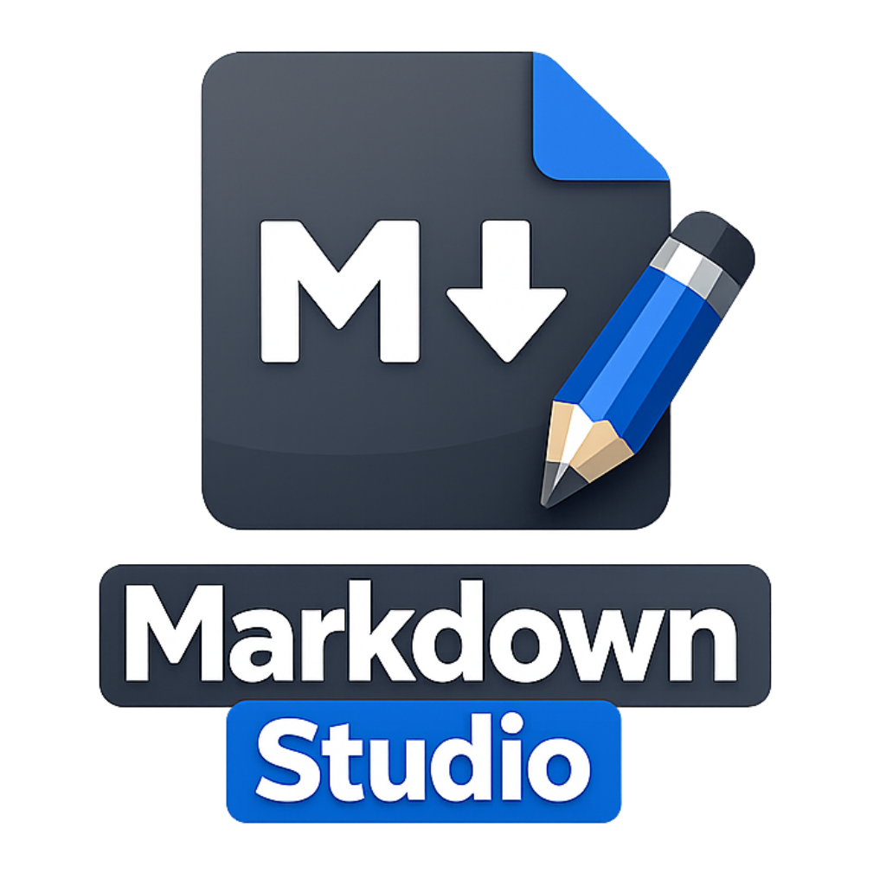

<p align="center">
  
</p>

<h1 align="center">Markdown Studio</h1>

<p align="center">
  A distraction-free, offline-first Markdown editor &amp; viewer for Android — built with Kotlin &amp; Jetpack Compose.
</p>

<p align="center">
  
  
  
  
  
</p>

---

## What is Markdown Studio?

Markdown Studio is a fully offline, native Android Markdown editor and viewer that puts you in control of your documents. No cloud dependency, no subscriptions just a fast, polished writing and reading experience powered by a custom AST-based parser and Jetpack Compose's reactive UI.

It supports everything from **headings, tables, task lists, code blocks with syntax highlighting**, to **math formulas**, **Mermaid diagrams**, **text highlights with annotations**, **multi-tab browsing**, **PDF export**, and **9 reading themes** all rendered natively without WebView.

---

## Features

- 📝 **Full Markdown Rendering** — Custom AST parser supporting headings, bold, italic, strikethrough, tables, lists, task lists, blockquotes, footnotes, images, links, inline code, and code blocks with line numbers.
- 🎨 **9 Reading Themes** — Light, Dark, AMOLED, Sepia, Solarized, Nord, Forest, High Contrast variants — switch instantly while reading.
- 🔍 **Source / Preview / Split Views** — Edit raw Markdown, view the rendered preview, or use side-by-side split mode.
- 📑 **Multi-Tab Browsing** — Open several documents at once with a persistent tab bar and recently-closed tab recovery.
- 🖍️ **Highlights & Annotations** — Select text, highlight in 5 colors, and attach notes. All stored locally via Room.
- 🔢 **Math & Diagram Support** — Render `$$` math blocks and ` ```mermaid ` diagrams natively.
- 📄 **PDF Export** — Export any document as a properly formatted A4 PDF using the native Android `PdfDocument` API.
- 📂 **SAF File Picker** — Open `.md` / `.txt` files from anywhere on device with persistent URI permissions across restarts.
- 📊 **Reading Statistics** — Word count, character count, reading time, and counts of images, tables, code blocks, math & diagram blocks.
- 🔎 **In-File Search** — Full-text search with prev/next navigation and auto-scroll to match.
- ⭐ **Favorites & Recents** — Star important documents; quickly access history with search/filter.
- 📤 **Share** — Share document content via Android's share sheet.
- 🌙 **App Theme** — System, Light, or Dark mode via Material 3 dynamic color.
- 🧩 **Gemini AI Integration** — AI-powered features via Firebase & Gemini API (configurable).

---

## Tech Stack

| Layer | Technology |
|-------|-----------|
| Language | Kotlin 2.2.10 |
| UI | Jetpack Compose + Material 3 |
| Architecture | MVVM (AndroidViewModel + StateFlow) |
| Navigation | Navigation Compose 2.8.9 |
| Local Storage | Room (SQLite) with KSP |
| Image Loading | Coil Compose 2.7.0 |
| Networking | Retrofit 2.12 + OkHttp 4.10 + Moshi 1.15 |
| PDF Export | Native Android `PdfDocument` API |
| AI | Firebase AI (Gemini API) |
| Testing | JUnit 4, Robolectric 4.16, Roborazzi 1.59 |
| Build | Gradle Kotlin DSL + AGP 9.1.1 |
| CI | GitHub Actions — debug APK on push to `main` |

---

## UI Screens

| Screen | Description |
|--------|------------|
| Home | Recent files, favorites, samples, search, and folder browser — all from a single screen with a collapsible drawer |
| Reader | Rendered preview with floating toolbar, scroll progress, TOC, and tab bar |
| Editor | Raw Markdown source with inline editing and real-time split preview |
| Themes | 9 reading themes + adjustable font family, size, and line spacing |

---

## Installation

```bash
# 1. Clone the repository
git clone https://github.com/mohitpandeycs/Markdown-Studio.git
cd Markdown-Studio

# 2. Open in Android Studio (Ladybug or newer)
# The project will sync Gradle automatically.

# 3. Set up environment variables (optional — for Gemini AI features)
cp .env.example .env
# Add your GEMINI_API_KEY in .env

# 4. Build & run
./gradlew assembleDebug
# Install the APK from app/build/outputs/apk/debug/app-debug.apk
```

### Environment Variables

```env
GEMINI_API_KEY=your_google_gemini_api_key
```

> ⚠️ The app works fully offline without any API key. Gemini features (AI-assisted actions) require the key but are entirely optional.

---

## Folder Structure

```
Markdown-Studio/
├── app/
│   ├── build.gradle.kts              # App module build config
│   ├── src/
│   │   ├── main/java/com/example/
│   │   │   ├── MainActivity.kt       # Entry point + NavHost
│   │   │   ├── data/                 # Room DB, DAOs, entities, repository
│   │   │   ├── parser/               # Custom AST Markdown parser
│   │   │   ├── ui/
│   │   │   │   ├── components/       # Reusable Compose components
│   │   │   │   ├── screens/          # HomeScreen, MarkdownReaderScreen
│   │   │   │   └── theme/            # Colors, ReadingTheme, Typography
│   │   │   ├── util/                 # PdfExportManager
│   │   │   └── viewmodel/            # DocumentViewModel, ReaderViewModel
│   │   ├── test/                     # Unit + screenshot tests
│   │   └── androidTest/              # Instrumented tests
├── assets/
│   └── app-icon.svg                  # App icon
├── gradle/
│   └── libs.versions.toml            # Version catalog
├── .env.example                      # API key template
├── .github/workflows/build.yml       # CI pipeline
├── build.gradle.kts                  # Root build file
├── settings.gradle.kts               # Project settings
├── gradle.properties                 # Gradle configuration
└── metadata.json                     # AI capability metadata
```

---

## How It Works

Markdown Studio parses `.md` files into an **abstract syntax tree (AST)** using a custom recursive-descent parser. Each node in the AST represents a Markdown element — heading, paragraph, list item, code block, table, etc. The Compose UI then walks this tree and renders each node as a corresponding Material 3 composable.

The rendering pipeline is:

1. **Source Input** — Raw Markdown text from SAF file, sample document, or editor.
2. **Parser** — AST-based parser converts text to a tree of `MarkdownNode` objects (block-level + inline).
3. **Render Engine** — Composable functions map node types to UI elements (styled `Text`, `LazyColumn`, code blocks with syntax colors, math formulas, Mermaid diagrams).
4. **Reader UI** — A scrollable preview with TOC, search, highlights overlay, and theme application.

### State Management

```kotlin
// Room Database Entities
recent_documents   — path, title, snippet, timestamp, isFavorite
reader_settings    — theme, fontFamily, fontSize, lineSpacing
highlight_notes    — docId, color, note, start/end offset
open_tabs          — docId, title, position
```

### Key Components

| Component | Responsibility |
|-----------|---------------|
| `MarkdownParser.kt` | Custom AST parser (block + inline) with 20+ node types |
| `MarkdownRenderComponents.kt` | Renders parsed AST as Compose UI |
| `CodeBlockComponents.kt` | Syntax-highlighted code blocks with copy, line wrap |
| `MathRenderComponents.kt` | Display math formulas (`$$` / `$`) |
| `MermaidRenderComponents.kt` | Basic Mermaid diagram rendering (graph, sequence, class) |
| `PdfExportManager.kt` | Native A4 PDF generation |
| `DocumentViewModel.kt` | Home screen state (documents, search, tabs) |
| `ReaderViewModel.kt` | Reader state (parsing, navigation, highlights, search) |

---

## Sample Documents

Markdown Studio ships with **4 pre-loaded samples** on first launch to showcase its rendering capabilities:

1. **Markdown Syntax Showcase.md** — Full feature reference
2. **Android Architecture Specification.md** — Technical spec with tables & code blocks
3. **Product Roadmap & Backlog.md** — Task lists & checkboxes
4. **The Art of Effective Reading.md** — Long-form article with math and diagrams

---

## Limitations & Future Work

- **No WebView** — All rendering is native Compose, which means no CSS-level customization (by design — keeps it lightweight and fast).
- **Basic Mermaid support** — Only a subset of Mermaid diagram types (LR, TD, sequence, class) are rendered.
- **Math rendering** — Displayed as styled text rather than a full LaTeX engine; suitable for basic formulas.
- **Single-window** — No split-pane document editing or multi-window support yet.
- **Cloud sync** — No backup or cross-device sync (intentionally offline-first).
- **Future plans** — Rich markdown editor toolbar, custom themes, webdav sync, annotation export, and Gemini-powered summarization / Q&A.

---

## Connect With Me :)

Built and maintained by **Mohit Pandey**

- GitHub — [@mohitpandeycs](https://github.com/mohitpandeycs)
- LinkedIn — [in/mohitpandeycs](https://linkedin.com/in/mohitpandeycs)
- X — [@mohitpandeycs](https://x.com/mohitpandeycs)

---

## License

This project is released under the [MIT License](https://opensource.org/licenses/MIT).

---

> If you find Markdown Studio useful, consider giving it a ⭐ Star — it helps other developers discover the project.
